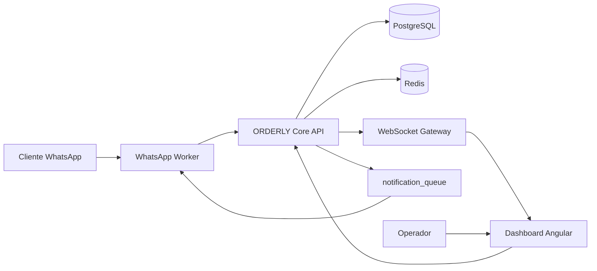
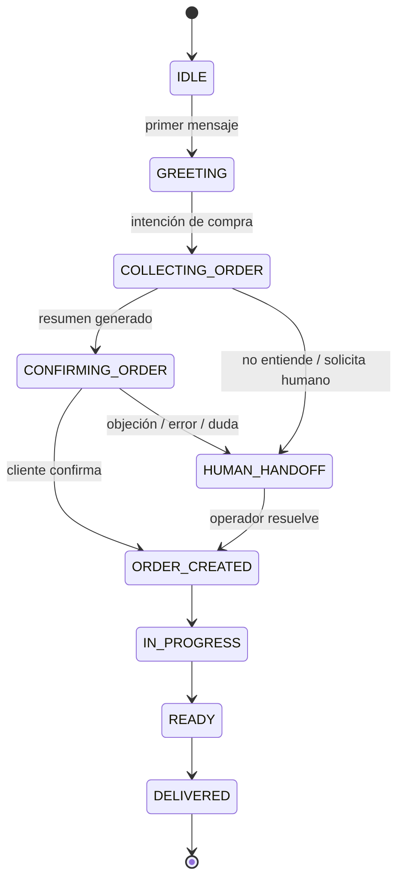
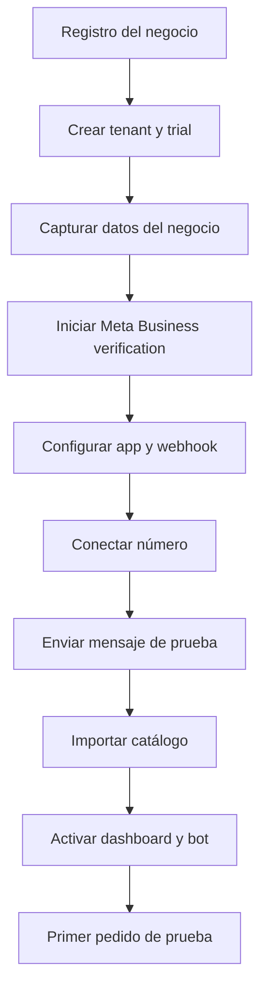
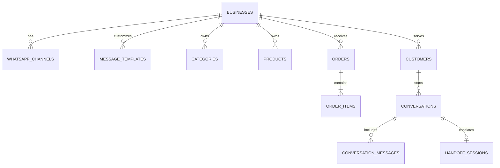

# ORDERLY — Architecture Completion Pack v2.2

Estado: listo para iniciar desarrollo
Fecha: 2026-04-20
Base de referencia: versión 2.1 del documento arquitectónico

---

## 1. Objetivo de este complemento

Este documento cierra los gaps detectados en la arquitectura v2.1 para que el equipo pueda arrancar desarrollo sin bloqueos entre backend, frontend y onboarding con Meta.

### Gaps resueltos

- Gap 1: tablas faltantes para esquema inicial y migraciones
- Gap 2: contrato REST para que Angular y Spring trabajen en paralelo
- Gap 3: flujo de onboarding de Meta con tiempos, responsables y dependencias
- Gap 4: configuración del número WhatsApp del negocio
- Gap 5: mensajes personalizados por tenant y por tipo de negocio
- Gap 6: diagramas técnicos mínimos para arrancar programación

---

## 2. Decisiones funcionales añadidas

### 2.1 Configuración por negocio
Cada tenant debe poder configurar:

- nombre comercial
- tipo de negocio
- número de WhatsApp conectado
- horario de atención
- dirección y zonas de entrega
- saludo inicial
- mensaje fuera de horario
- mensaje de confirmación de pedido
- mensaje de cambio de estado
- mensaje de handoff a humano

### 2.2 Personalización de mensajes
Los mensajes deben variar por tenant y por tipo de negocio. ORDERLY manejará dos niveles:

1. Plantillas del sistema por vertical:
   - restaurante
   - droguería
   - tienda general
   - repuestos
   - ropa

2. Override por negocio:
   - cada negocio puede editar el texto final
   - se permiten variables dinámicas como {{customer_name}}, {{business_name}}, {{order_number}}, {{total}}, {{eta_minutes}}

### 2.3 Reglas multi-tenant
Toda tabla operativa debe incluir business_id. Toda consulta de negocio debe venir filtrada por business_id desde el token JWT o desde el TenantContext del backend.

---

## 3. Diagramas necesarios para desarrollo

## 3.1 Arquitectura de alto nivel

## 3.2 Flujo de pedido y handoff

## 3.3 Onboarding Meta paso a paso

## 3.4 Modelo de configuración por tenant

---

## 4. Modelo de datos faltante y completado

La migración inicial lista para Flyway se dejó en:

- [db/migrations/V1__init_orderly_core_schema.sql](../db/migrations/V1__init_orderly_core_schema.sql)

### 4.1 Tablas que faltaban y ahora quedan definidas

#### categories
Propósito: organizar el catálogo por tenant.

Campos clave:
- id
- business_id
- name
- description
- sort_order
- is_active
- created_at
- updated_at

#### customers
Propósito: almacenar la identidad y contexto del cliente WhatsApp.

Campos clave:
- id
- business_id
- whatsapp_number
- full_name
- address_line1
- city
- notes
- tags
- total_orders
- total_spent
- last_order_at

#### order_items
Propósito: detalle de cada producto dentro de un pedido.

Campos clave:
- id
- order_id
- business_id
- product_id
- product_name_snapshot
- quantity
- unit_price
- subtotal
- customization
- notes

#### plans
Propósito: definir límites y pricing del SaaS.

Campos clave:
- id
- code
- name
- monthly_price_cop
- annual_price_cop
- monthly_order_limit
- product_limit
- user_limit
- template_limit
- handoff_enabled
- analytics_enabled
- custom_messages_enabled
- trial_days

#### subscriptions
Propósito: enlazar cada negocio con su plan y su ciclo de cobro.

Campos clave:
- id
- business_id
- plan_id
- provider
- external_subscription_id
- status
- trial_ends_at
- current_period_start
- current_period_end
- cancel_at_period_end

### 4.2 Tablas adicionales necesarias para arrancar bien

#### whatsapp_channels
Resuelve la configuración del número del negocio.

Campos clave:
- business_id
- display_name
- phone_number
- phone_number_id
- waba_id
- access_token_encrypted
- verify_token_hash
- webhook_secret
- status
- quality_rating

#### message_templates
Resuelve la personalización de mensajes por negocio y por vertical.

Campos clave:
- business_id opcional
- business_type
- event_type
- locale
- channel
- template_name
- body_template
- footer_text
- buttons
- variables
- is_default
- is_active

### 4.3 Límite de pedidos por plan

Regla operativa recomendada para el MVP:

| Plan | Límite mensual de pedidos | Productos | Usuarios | Plantillas personalizadas |
|---|---:|---:|---:|---:|
| Básico | 300 | 100 | 2 | 3 |
| Pro | 1200 | 500 | 10 | 20 |
| Premium | 5000 | 2000 | 50 | 100 |

Comportamiento al exceder el límite:
- se permite cerrar el pedido actual
- se bloquean nuevos pedidos automáticos al siguiente intento
- el dashboard muestra alerta de upgrade
- el cliente final nunca ve mensajes internos de bloqueo; recibe un mensaje neutro y se deriva a humano si aplica

---

## 5. Contrato REST mínimo para desarrollo paralelo

El contrato detallado se dejó en:

- [docs/openapi-orderly-v1.yaml](openapi-orderly-v1.yaml)

### 5.1 Módulos REST mínimos

#### Autenticación
- POST /api/v1/auth/login
- POST /api/v1/auth/refresh
- GET /api/v1/me

#### Negocio y onboarding
- POST /api/v1/businesses
- GET /api/v1/businesses/{businessId}
- PATCH /api/v1/businesses/{businessId}
- POST /api/v1/businesses/{businessId}/onboarding/start
- GET /api/v1/businesses/{businessId}/onboarding/status

#### Configuración del número WhatsApp
- GET /api/v1/businesses/{businessId}/whatsapp-channel
- PUT /api/v1/businesses/{businessId}/whatsapp-channel
- POST /api/v1/businesses/{businessId}/whatsapp-channel/verify

#### Mensajes personalizados
- GET /api/v1/businesses/{businessId}/message-templates
- PUT /api/v1/businesses/{businessId}/message-templates/{templateId}
- POST /api/v1/businesses/{businessId}/message-templates/preview

#### Límites y suscripción
- GET /api/v1/plans
- GET /api/v1/businesses/{businessId}/limits
- POST /api/v1/businesses/{businessId}/subscriptions/change-plan

#### Catálogo
- GET /api/v1/businesses/{businessId}/categories
- POST /api/v1/businesses/{businessId}/categories
- GET /api/v1/businesses/{businessId}/products
- POST /api/v1/businesses/{businessId}/products

#### Pedidos
- GET /api/v1/businesses/{businessId}/orders
- POST /api/v1/businesses/{businessId}/orders
- PATCH /api/v1/businesses/{businessId}/orders/{orderId}/status

#### Conversaciones y HUMAN_HANDOFF
- GET /api/v1/businesses/{businessId}/conversations
- GET /api/v1/businesses/{businessId}/conversations/{conversationId}
- POST /api/v1/businesses/{businessId}/conversations/{conversationId}/handoff
- POST /api/v1/businesses/{businessId}/conversations/{conversationId}/return-to-bot

#### Webhooks
- GET /api/v1/webhooks/whatsapp/{businessId}
- POST /api/v1/webhooks/whatsapp/{businessId}

---

## 6. Flujo de onboarding de Meta

### 6.1 Riesgo operativo
La verificación de Meta puede tardar de 2 a 7 días hábiles, por lo que debe iniciarse desde Fase 0 y no esperar a Fase 4.

### 6.2 Prerrequisitos

- correo corporativo del negocio o del tenant creador
- documento legal del negocio si Meta lo requiere
- nombre comercial estable
- número telefónico no conectado a otra cuenta incompatible de WhatsApp Business API
- acceso administrativo al Business Manager

### 6.3 Flujo paso a paso

#### Paso 1 — Crear tenant en ORDERLY
Entrada:
- nombre del negocio
- tipo de negocio
- país y moneda
- horario de atención

Salida:
- tenant creado en estado SETUP
- trial activo

#### Paso 2 — Iniciar verificación de Meta
Acción del usuario:
- abrir el asistente de conexión en el dashboard
- aceptar permisos
- vincular o crear Business Manager
- enviar documentación si Meta la solicita

Estado del sistema:
- business.status = PENDING_WHATSAPP
- whatsapp_channel.status = pending_meta_setup

#### Paso 3 — Conectar el número
Reglas:
- un número activo por tenant en MVP
- el número debe quedar validado contra el negocio correcto
- el sistema almacena phone_number_id y waba_id

#### Paso 4 — Configurar webhook
El worker registra:
- verify token
- webhook secret
- callback URL
- eventos: messages, statuses, message_template_status_update

#### Paso 5 — Probar mensajes
Se debe ejecutar un test guiado:
- saludo inicial
- creación de pedido de prueba
- actualización de estado
- handoff a operador

#### Paso 6 — Activar el negocio
Condición para pasar a ACTIVE:
- webhook verificado
- al menos una plantilla de mensaje activa
- catálogo mínimo cargado
- pedido de prueba recibido correctamente

### 6.4 Fallback si Meta se demora
Mientras Meta termina verificación:
- permitir carga de catálogo
- permitir configuración de plantillas
- permitir tour del dashboard con datos demo
- permitir usar número sandbox o demo de ORDERLY para validación interna

---

## 7. Configuración del número del negocio

### 7.1 Reglas del MVP
- un solo número WhatsApp por negocio en MVP
- un tenant no puede reutilizar el número de otro tenant
- el número debe quedar enmascarado parcialmente en la UI para seguridad
- los tokens deben almacenarse cifrados

### 7.2 Pantalla requerida en Angular
La vista de configuración debe incluir:

- estado de conexión del número
- display name
- número conectado
- calidad de la línea
- última sincronización
- botón de reconectar
- botón de enviar mensaje de prueba
- logs recientes del webhook

### 7.3 Estados recomendados
- pending_meta_setup
- pending_verification
- active
- degraded
- disconnected
- blocked_by_meta

---

## 8. Sistema de mensajes personalizados

### 8.1 Eventos que deben soportar plantilla
- welcome_message
- after_hours_message
- order_received
- order_confirmed
- order_in_preparation
- order_ready
- order_delivered
- payment_pending
- human_handoff_started
- human_handoff_resolved

### 8.2 Variables dinámicas permitidas
- customer_name
- business_name
- order_number
- order_total
- eta_minutes
- support_phone
- payment_link

### 8.3 Resolución de plantillas
Orden de prioridad:
1. plantilla personalizada del negocio
2. plantilla por vertical de negocio
3. plantilla default del sistema

### 8.4 Ejemplo por vertical

#### Restaurante
"Hola {{customer_name}}, tu pedido #{{order_number}} ya está en preparación 🍽️"

#### Droguería
"Hola {{customer_name}}, estamos validando la disponibilidad de tus productos. Te confirmamos en breve."

#### Ropa
"Hola {{customer_name}}, ya apartamos tu pedido #{{order_number}}. Te compartimos el total y opciones de entrega."

---

## 9. WebSocket events mínimos

Eventos para el dashboard:
- order.created
- order.updated
- conversation.updated
- handoff.opened
- handoff.resolved
- notification_queue.alert
- limit.threshold_reached

Canales sugeridos:
- /topic/business/{businessId}/orders
- /topic/business/{businessId}/conversations
- /topic/business/{businessId}/alerts

---

## 10. Checklist de arranque real para programación

### Backend Spring Boot
- implementar TenantContext y filtros JWT
- montar Flyway con la migración inicial
- exponer contrato REST v1
- conectar webhook de WhatsApp Worker
- implementar engine de plantillas
- implementar machine state del bot

### Frontend Angular
- login y selección de negocio
- onboarding wizard
- pantalla de número WhatsApp
- CRUD de categorías y productos
- tablero Kanban de pedidos
- módulo de conversaciones y handoff
- editor de plantillas con preview

### Infraestructura
- Docker Compose con postgres, redis y api
- variables de entorno por entorno
- secretos cifrados para Meta
- observabilidad mínima con logs estructurados

### Definition of Done para iniciar pilotos
- pedido real entra por webhook
- se ve en dashboard en menos de 2 segundos
- operador puede responder desde handoff
- cambios de estado notifican al cliente
- límites del plan se aplican correctamente

---

## 11. Recomendación final

Con este complemento ya no quedan bloqueos de arquitectura para comenzar desarrollo del MVP. El siguiente paso recomendado es convertir este paquete en:

1. backlog técnico por sprint
2. proyecto base Spring Boot
3. proyecto base Angular
4. Docker Compose local

